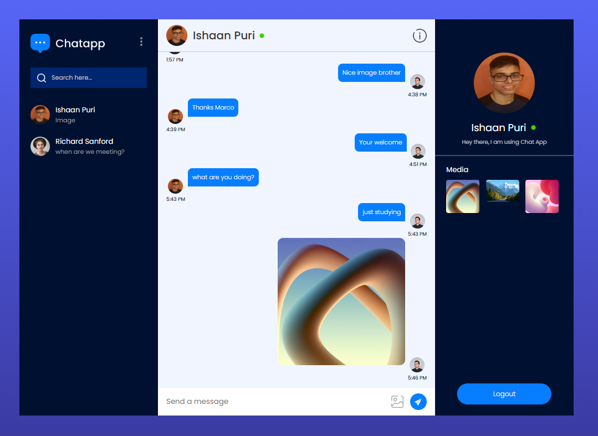

# **ChatApp**

ChatApp is a real-time full-stack chat application built using React JS and Firebase. The application allows users to create accounts, send messages, and share images seamlessly in real time.

## **Features**

### **1. User Authentication**

- Firebase Authentication for secure user registration and login.
- Password reset functionality to help users recover their accounts

### **2. Real-time Messaging**

- Send messages in real-time using Firestore Database.
- Text and image messaging support.
- Media sharing functionality with Firebase Storage for handling images.

### **3. Profile Management**

- Users can update their profile information including name, avatar, and status.
- Search users by their username to find and connect with friends.

### **4. Friends and Messaging**

- Add friends by searching usernames.
- Message friends directly from the chat interface.
- Real-time message delivery with instant updates across devices.

### **5. Responsive UI**

- The chat interface is responsive and optimized for both desktop and mobile devices.

### **6. Additional Features**

- Password Reset functionality to recover forgotten accounts.
- Profile updates for customizing user information and preferences.
- Friend requests and friend management.
- Search users by their username to connect with new people.
- Image sharing alongside messages, stored securely via Firebase Storage.

## **Tech Stack**

- **Frontend:** React.js
- **Backend:** Firebase (Firestore, Authentication, Storage)
- **Styling:** CSS(Responsive design)

## **Screenshots**

